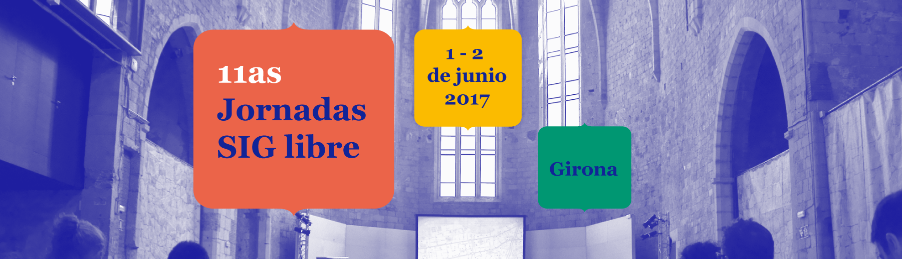

# AESIG

Jorge Sanz · Santiago Higuera

2017-06-01

---

# Agenda

- Historia de AESIG
- Historia de Geoinquietos
- Por qué Geoinquietos se interesa en AESIG
- Qué se puede esperar de AESIG

---

# AESIG
___

## Historia

* Arranca en 1989
___

 <!-- .element style="max-width:45%;height:400px;" -->
 <!-- .element style="max-width:45%;height:400px;" -->

___

## Historia

* Arranca en 1989
* Asociación sin ánimo de lucro
* Ley de asociaciones de 1964
* Miembro de EUROGI
* Cierta actividad en los 90s y principio de 00s
* Desde 2007 a menos
* Última actualización de la web en 2012

___

## Objetivos

* Promoción de la tecnología SIG
* Foro de debate
* Normalizar los SIG
* SIG + instituciones
* Promoción SIG
* Favorecer I+D en SIG

---

# Geoinquietos

___

## Historia

* Arranca tras el FOSS4G 2010 (Barcelona)
* Primer grupo: Geoinquiets
* Otras ciudades en España e Iberoamérica se suman

___

http://geoinquietos.org

___

## En España

---

## Geoinquietos & AESIG

> G: Necesitamos una entidad legal

> G: Vamos a escribir a AESIG  
> a ver qué pasa <!-- .element class="fragment" -->

> A: ¡Venid! <!-- .element class="fragment" -->

---

## Nueva junta

---

## En qué estamos trabajando

* Recuperar la web http://aesig.github.io
* Normalizar tesorería <!-- .element class="fragment" -->
* Actualizar estatutos <!-- .element class="fragment" -->
* Plan de actividades <!-- .element class="fragment" -->

---

## Qué esperar de AESIG

* Promoción de la tecnología SIG ??
* Foro de debate ??
* Normalizar los SIG ??
* SIG + instituciones ??
* Promoción SIG ??
* Favorecer I+D en SIG ??
* ???  <!-- .element class="fragment" -->

---

# Gracias!

contacto.aesig@gmail.com

Jorge Sanz · Santiago Higuera

2017-06-01

